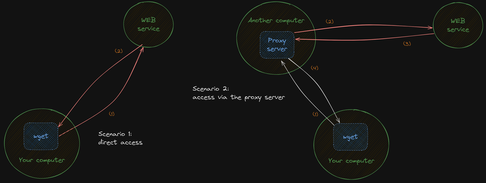

# Toralizer: Hijacking and Intercepting Library Calls on Linux and macOS

## Intro

I got inspired by the videos by Dr. Jonas Birch
([part 1](https://www.youtube.com/watch?v=Pebul1c9JKE),
[part 2](https://www.youtube.com/watch?v=OctCf0wSYNY)) and decided to play with
such technics to understand the technology better.

## Disclaimer

**This tool is implemented solely for educational and study purposes. It is not
designed or intended to provide real anonymity or mask your identity in actual
usage.** Please use responsibly and only in compliance with applicable laws and
regulations.

## Overview

**Toralizer** is a tool for redirecting library functions, specifically for
hijacking and intercepting network calls of programs to redirect traffic through
a local Tor proxy server, thereby masking your identity.

### Key Concepts

- **Library Call Redirection**: Intercepting library and system calls like
  `connect` to route traffic through a proxy.
- **Tor Integration**: Redirecting network calls to the Tor network for
  anonymized communication.

**NOTE:** Actually, it is integration with any SOCKS4 proxy server (not
specifically Tor's local proxy) and in testing I will use a normal SOCKS4
[proxy server `dante`](https://github.com/notpeter/dante) running locally or
remotely as it is shown in the picture below (in the scenario 2):



## Setting up SOCKS4 proxy server

It is better to run your proxy server on some random port to make it harder for
be found and used by someone else on the Internet accidentally:

```bash
# Run bash command to get a random number in the range
$ shuf -i 49152-65535 -n 1
61298
```

Now let's start a Docker container with the proxy server locally for testing
purposes:

```bash
# Run a socks4 server locally as a Docker container on the port 61298
$ docker run -d -p 61298:1080 wernight/dante

# Test the socks4 server with curl
$ curl -v --socks4 127.0.0.1:61298 "ifconfig.so"
*   Trying 127.0.0.1:61298...
* Connected to 127.0.0.1 (127.0.0.1) port 61298
* SOCKS4 communication to ifconfig.so:80
* SOCKS4 non-blocking resolve of ifconfig.so
* Host ifconfig.so:80 was resolved.
...
```

If everything is fine, then go to `linux` and `macos` subdirectories to build
the shared library and hijack programs' library calls to connect to the network.

## Links

- [SOCKS 4 RFC](https://www.openssh.com/txt/socks4.protocol) - SOCKS: A protocol
  for TCP proxy across firewalls
- [Hooking Shared Library](https://rjordaney.is/lectures/hooking_shared_lib/)
